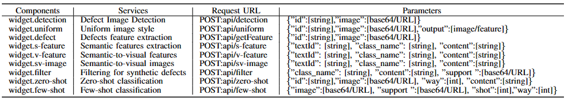

# Graph-based Sample Synthesizing Model for Few- and Zero-shot Compatible Surface Defect Classification in Smart Manufacturing

#### INTRODUCTION
Surface defect classification exhibits great importance in improving the performance of manufacturing automation. Unlike general image classification which has massive training samples, defect samples are very rare or some are never seen before since smart manufacturing techniques have significantly avoided the normal defects. Effectively detecting the rare-seen and unseen surface defects thus become one of the most critical factors to further improve the performance of smart manufacturing. However, existing few-shot defect classification methods do not support predicting unseen defects while general zero-shot classification methods do work not well in manufacturing data environments. To this end, this paper proposes a novel few- and zero-shot compatible surface defect classification model for manufacturing defect detection. First, a novel Cycle-GAN model is proposed to synthesize defect visual features from the corresponding semantic features (text description about the defects) to augment the support samples. Then, a support and query sample fused graph is built to establish the potential relationships among support samples and query samples. After, a graph-based center feature updating method is proposed to match the query features to the corresponding class, including unseen classes. Massive experiments, including few- and zero-shot defect classification, on four real-world manufacturing datasets show the proposed method significantly surpasses previous state-of-the-art methods in all tasks. In highlights, our method has +4.9% improvements on the non-trivial dataset (MSD-Cls) for few-shot tasks, +3.5% improvements on cross-domain few-shot tasks and +3.5∼7.4% improvements on zero-shot tasks, compared with the state-of-the-art. Also, the proposed model is deployed on a prototype manufacturing scenario that further demonstrates the applicability of the work.

#### Performance Evaluation Video
###### Google Link https://drive.google.com/file/d/1OxZKZI3c7vXAGYem2TmhfVGpwgmEaxqA/view
###### Baidu Link: https://pan.baidu.com/s/1kUjdzvZkZU98jZiIIY-yBw?pwd=pd2g Password: pd2g

#### RESTful APIs

#### DATASETS
datasets: Four real-world industrial defect datasets, MSD-Cls [10], DAGM [59], KTH [60], and KTD [61], areused for both few-shot and zero-shot tasks. MSD-Cls is a metal surface defect dataset that contains aluminum and steel with different defect types. DAGM is an industrial optical inspection dataset that mainly includes miscellaneous defects on various statistically textured backgrounds. KTH is a manufacturing texture dataset that consists of a small amount of sample data for each class in the texture image database KTH-TIPS [60] under different illumination, pose, and scale. KTD is a unique texture patch dataset about floor, wall, stone, grass, etc.

Four dataset images with text links：https://pan.baidu.com/s/1t25FUZdV-G-yS10MgvHeZA    Password：9edw

